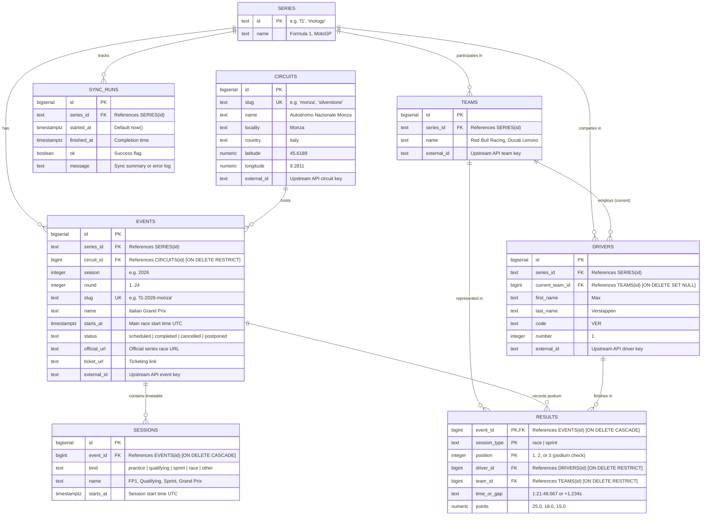
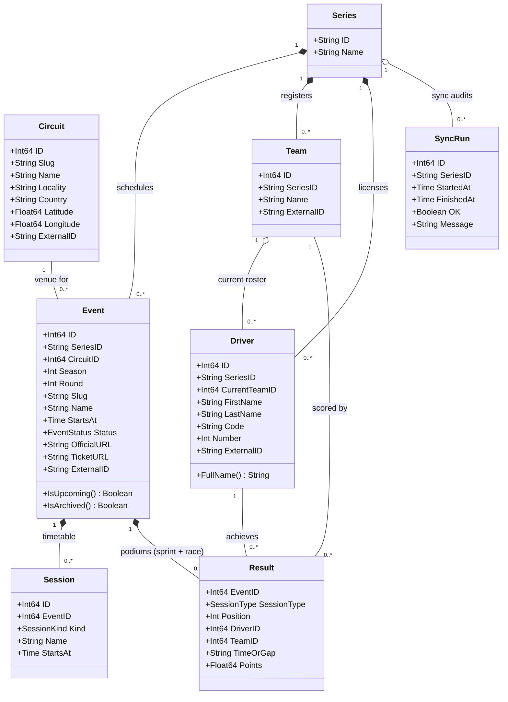

# Database Architecture & UML Specification

This document defines the complete PostgreSQL database design and domain model for **NutzMotosportCalendar** (Supabase Postgres, consumed via Go `pgx` + `sqlc`).

---

## 1. Relational Entity-Relationship Diagram (ERD)

Physical schema representation showing tables, primary keys (`PK`), foreign keys (`FK`), and relational cardinality.



---

## 2. UML Domain Class Diagram

Object-oriented domain model representing entities, attributes, and structural associations for the Go backend.



---

## 3. Table Schema Dictionaries

### 3.1 `series`
Static lookup table for motorsport series.

| Column | Type | Constraints | Description |
|---|---|---|---|
| `id` | `TEXT` | `PRIMARY KEY` | Unique series code: `'f1'`, `'motogp'` |
| `name` | `TEXT` | `NOT NULL` | Series display name (`Formula 1`, `MotoGP`) |

*Initial seed:* `('f1', 'Formula 1')`, `('motogp', 'MotoGP')`.

---

### 3.2 `circuits`
Physical racing venues and tracks.

| Column | Type | Constraints | Description |
|---|---|---|---|
| `id` | `BIGSERIAL` | `PRIMARY KEY` | Surrogate identifier |
| `slug` | `TEXT` | `NOT NULL UNIQUE` | URL/lookup identifier (e.g. `'monza'`, `'silverstone'`) |
| `name` | `TEXT` | `NOT NULL` | Circuit name (e.g. `'Autodromo Nazionale Monza'`) |
| `locality` | `TEXT` | `NOT NULL` | City or region (e.g. `'Monza'`) |
| `country` | `TEXT` | `NOT NULL` | Country name (e.g. `'Italy'`) |
| `latitude` | `NUMERIC(9,6)` | `NULL` | Track coordinates |
| `longitude` | `NUMERIC(9,6)` | `NULL` | Track coordinates |
| `external_id`| `TEXT` | `NULL` | Upstream API circuit key (e.g. Jolpica `circuitId`) |

---

### 3.3 `teams`
Constructors and racing teams.

| Column | Type | Constraints | Description |
|---|---|---|---|
| `id` | `BIGSERIAL` | `PRIMARY KEY` | Surrogate identifier |
| `series_id` | `TEXT` | `NOT NULL REFERENCES series(id)` | Which championship (`f1` or `motogp`) |
| `name` | `TEXT` | `NOT NULL` | Team name (e.g. `'Scuderia Ferrari'`, `'Ducati Lenovo Team'`) |
| `external_id`| `TEXT` | `NULL` | Upstream API identifier |

---

### 3.4 `drivers`
Racing competitors.

| Column | Type | Constraints | Description |
|---|---|---|---|
| `id` | `BIGSERIAL` | `PRIMARY KEY` | Surrogate identifier |
| `series_id` | `TEXT` | `NOT NULL REFERENCES series(id)` | Which championship |
| `current_team_id` | `BIGINT` | `REFERENCES teams(id) ON DELETE SET NULL` | Driver's current active team |
| `first_name` | `TEXT` | `NOT NULL` | Given name |
| `last_name` | `TEXT` | `NOT NULL` | Family name |
| `code` | `TEXT` | `NULL` | 3-letter timing code (e.g. `'VER'`, `'HAM'`, `'MM93'`) |
| `number` | `INT` | `NULL` | Permanent race number |
| `external_id`| `TEXT` | `NULL` | Upstream API driver identifier |

---

### 3.5 `events`
Grand Prix weekends and race meetings.

| Column | Type | Constraints | Description |
|---|---|---|---|
| `id` | `BIGSERIAL` | `PRIMARY KEY` | Surrogate identifier |
| `series_id` | `TEXT` | `NOT NULL REFERENCES series(id)` | Championship |
| `circuit_id` | `BIGINT` | `NOT NULL REFERENCES circuits(id) ON DELETE RESTRICT` | Host venue |
| `season` | `INT` | `NOT NULL` | Year (e.g. `2026`) |
| `round` | `INT` | `NOT NULL` | Calendar round order number |
| `slug` | `TEXT` | `NOT NULL UNIQUE` | SEO route (e.g. `'f1-2026-monza'`) |
| `name` | `TEXT` | `NOT NULL` | Official event title (`Italian Grand Prix`) |
| `starts_at` | `TIMESTAMPTZ` | `NOT NULL` | Main Sunday Grand Prix race start time (UTC) |
| `status` | `TEXT` | `NOT NULL DEFAULT 'scheduled'` | Status check: `'scheduled'`, `'completed'`, `'cancelled'`, `'postponed'` |
| `official_url` | `TEXT` | `NULL` | Upstream or official event page |
| `ticket_url` | `TEXT` | `NULL` | Official ticketing link |
| `external_id`| `TEXT` | `NULL` | Upstream API event identifier |

**Unique Constraint**: `UNIQUE (series_id, season, round)` enables idempotent `ON CONFLICT` updates during cron synchronization.

---

### 3.6 `sessions`
Weekend timetable components (Practice, Qualifying, Sprint, Main Race).

| Column | Type | Constraints | Description |
|---|---|---|---|
| `id` | `BIGSERIAL` | `PRIMARY KEY` | Surrogate identifier |
| `event_id` | `BIGINT` | `NOT NULL REFERENCES events(id) ON DELETE CASCADE` | Associated event |
| `kind` | `TEXT` | `NOT NULL` | Session kind: `'practice'`, `'qualifying'`, `'sprint'`, `'race'`, `'other'` |
| `name` | `TEXT` | `NOT NULL` | Display name (e.g. `'FP1'`, `'Sprint Shootout'`) |
| `starts_at` | `TIMESTAMPTZ` | `NOT NULL` | Exact session start time (UTC) |

---

### 3.7 `results`
Top-3 podium results for Sprint and Main races.

| Column | Type | Constraints | Description |
|---|---|---|---|
| `event_id` | `BIGINT` | `NOT NULL REFERENCES events(id) ON DELETE CASCADE` | Associated event |
| `session_type` | `TEXT` | `NOT NULL DEFAULT 'race'` | Category: `'race'` or `'sprint'` |
| `position` | `INT` | `NOT NULL CHECK (position BETWEEN 1 AND 3)` | 1st, 2nd, or 3rd place |
| `driver_id` | `BIGINT` | `NOT NULL REFERENCES drivers(id) ON DELETE RESTRICT` | Driver on podium |
| `team_id` | `BIGINT` | `NOT NULL REFERENCES teams(id) ON DELETE RESTRICT` | Team driver raced for |
| `time_or_gap` | `TEXT` | `NULL` | Race duration or gap to P1 |
| `points` | `NUMERIC(4,1)` | `NULL` | Points earned (e.g. 25.0, 18.0, 15.0) |

**Composite Primary Key**: `PRIMARY KEY (event_id, session_type, position)`. Prevents duplicate podium entries.

---

### 3.8 `sync_runs`
Audit and observability log for the background ingestion jobs.

| Column | Type | Constraints | Description |
|---|---|---|---|
| `id` | `BIGSERIAL` | `PRIMARY KEY` | Surrogate identifier |
| `series_id` | `TEXT` | `NOT NULL REFERENCES series(id)` | Series updated |
| `started_at` | `TIMESTAMPTZ` | `NOT NULL DEFAULT now()` | Ingestion start time |
| `finished_at`| `TIMESTAMPTZ` | `NULL` | Ingestion completion time |
| `ok` | `BOOLEAN` | `NOT NULL DEFAULT false` | Whether sync succeeded |
| `message` | `TEXT` | `NULL` | Ingestion summary or error trace |

---

## 4. Recommended Indexes

```sql
-- Fast home calendar and archive window filtering
CREATE INDEX idx_events_starts_at ON events(starts_at);
CREATE INDEX idx_events_series_season ON events(series_id, season);

-- Timetable ordering
CREATE INDEX idx_sessions_event_starts ON sessions(event_id, starts_at);

-- Podium lookups
CREATE INDEX idx_results_event_session ON results(event_id, session_type);

-- External sync lookups
CREATE INDEX idx_events_external_id ON events(series_id, external_id) WHERE external_id IS NOT NULL;
CREATE INDEX idx_drivers_external_id ON drivers(series_id, external_id) WHERE external_id IS NOT NULL;
CREATE INDEX idx_teams_external_id ON teams(series_id, external_id) WHERE external_id IS NOT NULL;
CREATE INDEX idx_circuits_slug ON circuits(slug);
```
